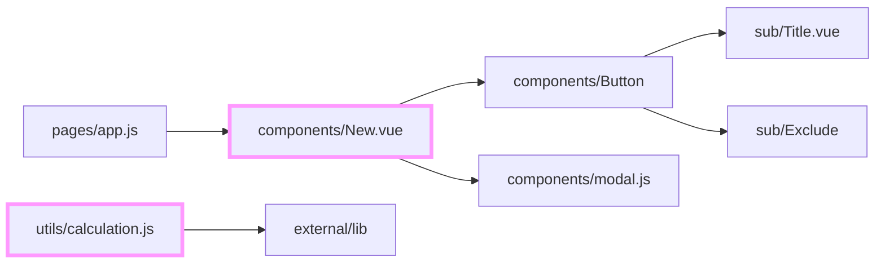

[](https://codecov.io/gh/junara/js_dependency)

# JsDependency

Welcome to your new gem! In this directory, you'll find the files you need to be able to package up your Ruby library into a gem. Put your Ruby code in the file `lib/js_dependency`. To experiment with that code, run `bin/console` for an interactive prompt.

Analyze import dependency of JavaScript code and export mermaid format.

"import dependency" is analyzed from import statement of JavaScript code and src path that is added to script tag.

## Installation

Install the gem and add to the application's Gemfile by executing:

    $ bundle add js_dependency

If bundler is not being used to manage dependencies, install the gem by executing:

    $ gem install js_dependency

## Usage
### By Command Line

#### Show version

```shell
js_dependency version
# => "X.X.X"
```

#### yaml configuration file

Configuration file is `./.js_dependency.yml`. This file includes parameters for the analysis.

```yaml
src_path: ./src # Root folder
target_path: ./src/App.vue # Target file tha you want to analyze
target_paths: # Target files tha you want to analyze
  - ./src/App1.vue
  - ./src/App2.vue
child_analyze_level: 2 # Output level of child analyze
parent_analyze_level: 2 # Output level of parent analyze
name_level: 1 # Output name level
output_path: ./mermaid.txt # Output file path
alias_paths: # Alias path
  "@": ./pages # absolute path or relative path of src_path
excludes: # Exclude words that you want to skip from export.
  - excludeWord1
  - excludeWord2
```

If you want to specify .js_dependency.yml as another path, you can add option path by `-f` option.

```shell
js_dependency -f path/to/yourfilename.yml
```

Each parameter is overridden by the command line.

```
src_path -> -s
target_path -> -t
child_analyze_level -> -c
parent_analyze_level -> -p
name_level -> -n
output_path -> -o
exclude -> -e
alias_paths -> -a
```

#### Export Mermaid Format

##### Single target path

```shell
js_dependency -s ./src -t ./src/App.vue -o ./mermaid.txt -c 2 -p 2 -n 1 -a @:./pages
```

##### Multiple target paths

```shell
js_dependency -s ./src -t ./src/App.vue ./src/components/Sub.vue -o ./mermaid.txt -c 2 -p 2 -n 1 -a @:./pages
```

##### Exclude path which include exclude words `-e` from output

```shell
js_dependency -s ./src -t ./src/App.vue -o ./mermaid.txt -c 2 -p 2 -n 1 -e excludeWord1 excludeWord2 -a @:./pages
```

#### Export Markdown report

```shell
js_dependency export_markdown_report -s ./src -t ./src/App.vue -c 2 -p 2 -n 1 -a @:./pages --identifier your_uniq_identifier_for_upsert_report --exclude_output_names pages
```

``--exclude_output_names`` option is used to exclude outputs from orphan list by name matching. In following results, include pages file is excluded from orphan.

Like this:

```
## JsDependency Reports

### Orphan modules

2 orphaned modules.

* ``components/sub/Exclude.vue``
* ``utils/calculation.js``

### Module dependency

\```mermaid
flowchart LR
components_Button["components/Button"] --> components_sub_Title.vue["sub/Title.vue"]
components_Button["components/Button"] --> fixtures_index_creator_self_call_src_components_sub_Exclude["sub/Exclude"]
components_New.vue["components/New.vue"] --> components_Button["components/Button"]
components_New.vue["components/New.vue"] --> components_modal.js["components/modal.js"]
pages_app.js["pages/app.js"] --> components_New.vue["components/New.vue"]
utils_calculation.js["utils/calculation.js"] --> external_lib["external/lib"]
style components_New.vue stroke:#f9f,stroke-width:4px
style utils_calculation.js stroke:#f9f,stroke-width:4px
\```

<!-- identifier -->

```

## JsDependency Reports

### Orphan modules

2 orphaned modules.

* ``components/sub/Exclude.vue``
* ``utils/calculation.js``

### Module dependency



<!-- identifier -->


#### Export parents components list

```shell
js_dependency parents -s ./src -t ./src/App.vue -o ./parents.txt -p 2 -a @:./pages
```

#### Export children components list

```shell
js_dependency childrent -s ./src -t ./src/App.vue -o ./children.txt -c 2 -a @:./pages
```

#### Export orphan components list

Components that are not used in other components.

```shell
js_dependency orphan -s ./src -a @:./pages
```

#### Export left components list

Components that do not import other components.

```shell
js_dependency leave -s ./src -a @:./pages
```

### By ruby code
If your javascript code is in `./src` and `./src/App.vue` is in the directory, you can analyze `./src/App.vue` dependency like this:

```ruby
require 'js_dependency'


src_path = './src' # Root folder.
target_path = './src/App.vue' # Target file that you want to analyze.
child_analyze_level = 2 # Output level of child dependency.
parent_analyze_level = 2 # Output level of parent dependency.
output_path = './mermaid.txt' # Optional. Output file path
alias_paths = {'@' => '/src' } # Optional. Alias path.

# mermaid出力実行
JsDependency.export_mermaid(
  src_path,
  target_path,
  child_analyze_level: child_analyze_level,
  parent_analyze_level: parent_analyze_level,
  output_path: output_path,
  alias_paths: alias_paths)
```

See `./mermaid.txt` of `output_path` for the result.

## Development

After checking out the repo, run `bin/setup` to install dependencies. Then, run `rake spec` to run the tests. You can also run `bin/console` for an interactive prompt that will allow you to experiment.

To install this gem onto your local machine, run `bundle exec rake install`. To release a new version, update the version number in `version.rb`, and then run `bundle exec rake release`, which will create a git tag for the version, push git commits and the created tag, and push the `.gem` file to [rubygems.org](https://rubygems.org).


### Using guard-rspec

```shell
bundle exec guard
```

## Contributing

Bug reports and pull requests are welcome on GitHub at https://github.com/junara/js_dependency. This project is intended to be a safe, welcoming space for collaboration, and contributors are expected to adhere to the [code of conduct](https://github.com/[USERNAME]/js_dependency/blob/main/CODE_OF_CONDUCT.md).

## License

The gem is available as open source under the terms of the [MIT License](https://opensource.org/licenses/MIT).

## Code of Conduct

Everyone interacting in the JsDependency project's codebases, issue trackers, chat rooms and mailing lists is expected to follow the [code of conduct](https://github.com/[USERNAME]/js_dependency/blob/main/CODE_OF_CONDUCT.md).
